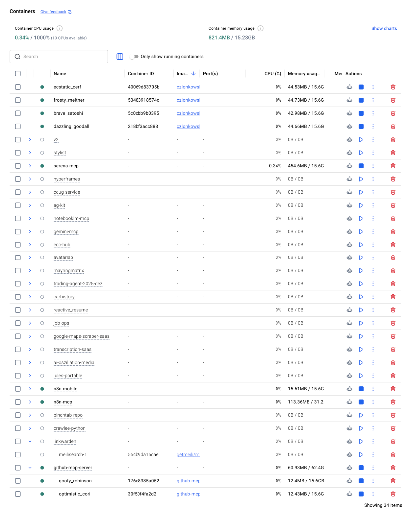
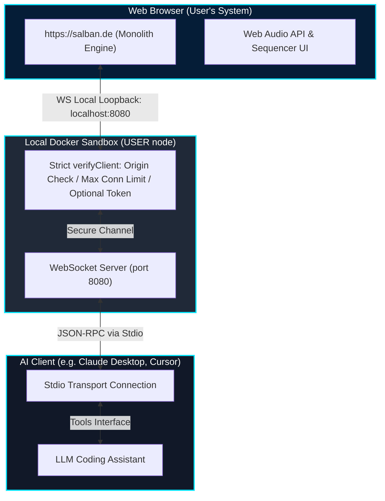

# SAL BAN Monolith Engine - Model Context Protocol (MCP) Server

This is the official Model Context Protocol (MCP) server for the [SAL BAN Monolith Engine](https://salban.de), a powerful, cutting-edge in-browser synthesizer and groovebox. 

This MCP server acts as a local WebSocket bridge, allowing agentic AI coding assistants (such as Claude Desktop, Cursor, or Antigravity) to directly program sequences, tweak synthesizer parameters, load audio samples, and interact with the Monolith Engine in real-time.



---

## 📐 Architecture & Data Flow

The integration runs entirely on the user's local machine, establishing a secure loopback connection between the browser, the sandboxed Docker container, and the AI client.



---

## 🔒 Security & Hardening by Design

Because the MCP server runs locally and connects to a public web interface, it is built with strict security measures to protect end-users:

1. **Docker Sandbox:** The server runs inside an unprivileged environment (`USER node`) instead of root. Compiled files inside `/app` are set to read-only (`755` owned by `root:root`) to prevent post-exploitation modification of execution binaries.
2. **Strict Origin Validation:** The WebSocket server strictly validates HTTP `Origin` headers, allowing connections **only** from `https://salban.de` and authorized local development hosts (e.g. `localhost:3000`). All other connection attempts (e.g., malicious background tabs) are rejected immediately with a `403 Forbidden` response.
3. **Connection Rate Limiting:** Limits connections to a maximum of 2 concurrent active WebSocket sockets to prevent denial-of-service (DoS) exploits.
4. **Payload Size Restriction:** Limits incoming frame sizes strictly to 15MB.
5. **Flexible Token Protection (Pro-Mode):** 
   - By default, it operates in a **Hybrid No-Token Mode** for a frictionless out-of-the-box experience.
   - For maximum security (e.g. preventing unauthorized local host scripts from accessing the bridge), you can activate **Token Pro-Mode** by setting the `SALBAN_MCP_TOKEN` environment variable. When set, clients must pass this token during the WebSocket handshake.

---

## ⚖️ GDPR (DSGVO) & EU AI Act Compliance

This project is built from the ground up to respect user privacy and comply with European regulatory frameworks.

### 🇪🇺 GDPR / DSGVO Compliance (Privacy by Design - Art. 25)

* **No Processing of Personal Data (PII):** The MCP server processes only technical telemetry and synthesis variables (tempo, notes, pitches, mute states, envelope parameters). It does not collect, log, or transmit personal data such as names, emails, IPs, or location telemetry.
* **100% Local Loopback (Art. 32 Security):** All communication occurs locally. No audio parameters or command payloads are sent to external servers or third parties.
* **Strict Necessity (Exemption from Cookie Banner):** The local token and configuration details stored in the browser's `localStorage` are technically necessary to establish and secure the local loopback WebSocket connection requested by the user, making it fully exempt from prior cookie consent requirements under ePrivacy guidelines.

### 🤖 EU AI Act Compliance

* **Low-Risk Classification:** This application acts as a creative assistant for music generation. It does not fall under the "High-Risk" categories (such as critical infrastructure, education, law enforcement, or biometrics) outlined in Annex III of the EU AI Act.
* **Transparency Requirement (Art. 52):** When using an AI co-producer via this MCP bridge, the user initiates all actions. There is complete transparency that an artificial intelligence model is generating the notes/sequences.
* **Human-in-the-Loop (HITL):** The user remains in complete control. All sequences generated by the AI can be edited, mutated, or muted in real-time via the web interface.

---

## 🚀 Installation & Getting Started

### 1. Build and Run via Docker (Recommended)

Building the container automatically compiles the TypeScript source code in a secure sandboxed multi-stage build.

#### Step A: Build the Docker Image
```bash
docker build -t salban-mcp-server:latest .
```

#### Step B: Run the Container

**Option A: Hybrid No-Token Mode (Frictionless / Default)**
Allows instant connection from `https://salban.de` via automatic origin verification:
```bash
docker run -d --name salban-mcp -p 8080:8080 salban-mcp-server:latest
```

**Option B: Token Pro-Mode (High Security)**
Enforces authentication with a custom static token:
```bash
docker run -d --name salban-mcp -p 8080:8080 -e SALBAN_MCP_TOKEN=your_secure_password salban-mcp-server:latest
```
*(Enter this token once on the salban.de interface when prompted; it will be securely cached in your browser's local storage).*

---

## 🛠️ Configuring AI Clients (Claude Desktop / Cursor)

To allow your AI assistant to use the MCP tools, add the server to your local Claude Desktop configuration file:

**On macOS:** `~/Library/Application Support/Claude/claude_desktop_config.json`  
**On Windows:** `%APPDATA%\Claude\claude_desktop_config.json`

Add the following entry (adjusting the paths or command if running via Docker):

### Running via Stdio (Native Docker)
```json
{
  "mcpServers": {
    "salban-monolith": {
      "command": "docker",
      "args": [
        "run",
        "-i",
        "--rm",
        "salban-mcp-server:latest"
      ]
    }
  }
}
```

---

## 📡 Registered MCP Tools

The server exposes 12 rich semantic tools to the AI assistant:

* **`salban_get_preset`**: Returns the active preset JSON state from the browser client.
* **`salban_apply_preset`**: Sends a complete preset JSON configuration to the browser.
* **`salban_tweak_parameter`**: Tweaks a single nested parameter (e.g., `synthParams.lead.cutoff`).
* **`salban_load_sample`**: Injects a Base64-encoded audio sample into a sampler pad (0–7).
* **`salban_inject_mcp_sample`**: Programmatically synthesizes standard electronic drum hits (kick, noise click) and injects them.
* **`salban_get_sequence`**: Returns the 16-step sequence for a specific voice.
* **`salban_set_pad_sequence`**: Sets triggers, pitch, reverse, and volume for a sampler pad's 16 steps.
* **`salban_set_drum_sequence`**: Sets kick/snare/hat 16-step velocity triggers.
* **`salban_set_synth_sequence`**: Sets note values, ties, and accents for bass/lead sequences.
* **`salban_set_voice_params`**: Sets loop length, speed, and direction.
* **`salban_clear_sequence`**: Silences all 16 steps of a voice.
* **`salban_get_parameter_schema`**: Returns valid tweakable parameters and LFO targets.

---

## 💻 Developer Setup

If you want to run the server locally outside of Docker for development:

1. Install dependencies:
   ```bash
   npm install
   ```
2. Compile and run:
   ```bash
   npm run build
   node build/index.js
   ```

---

## 📄 License
This project is licensed under the MIT License - see the LICENSE file for details.
